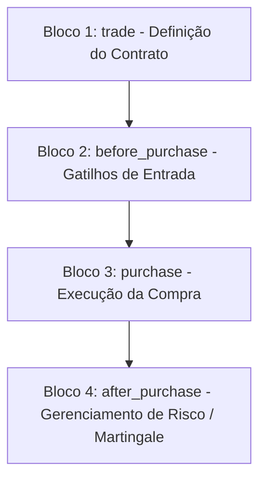

# 🤖 Mapeamento Estrutural e Arquétipos de Bots (Deriv DBot XML) - ORSTAC

Este documento serve como a base de conhecimento de RAG (Retrieval-Augmented Generation) para o ORSTAC AI Cognitive Agent. Ele categoriza, analisa e descreve os **3.360 robôs** em formato XML (Google Blockly) contidos no repositório, permitindo ao agente cognitivo realizar buscas semânticas, entender códigos de blocos e recomendar estratégias adequadas para os usuários.

---

## 📊 1. Distribuição Estatística do Repositório (Dados Forenses)

Uma varredura completa realizada em todos os arquivos XML identificou as seguintes distribuições empíricas do ecossistema de robôs da ORSTAC:

### 🎯 Distribuição por Mercados (Top 10)
| Ativo / Mercado | Quantidade de Bots | Proporção (%) | Descrição |
| :--- | :---: | :---: | :--- |
| **Volatility 100 Index** | 1.985 | 59,1% | O mercado mais volátil e popular para bots de Dígitos e Martingale rápido. |
| **Volatility 10 Index** | 314 | 9,3% | Movimentação mais suave, preferida para estratégias de tendência de médio prazo. |
| **Volatility 50 Index** | 296 | 8,8% | Equilíbrio médio de oscilação de mercado. |
| **Volatility 75 Index** | 191 | 5,7% | Volatilidade clássica, muito utilizada com indicadores tradicionais. |
| **Volatility 25 Index** | 161 | 4,8% | Baixa volatilidade constante. |
| *Unknown / Custom* | 95 | 2,8% | Bots sem mercado pré-configurado ou com dependência de variáveis de entrada. |
| **Volatility 10 (1s) Index** | 85 | 2,5% | Variação com ticks atualizados a cada 1 segundo (execução rápida). |
| **Volatility 100 (1s) Index** | 41 | 1,2% | Atualização ultra-rápida (1s) com amplitude máxima de variação. |
| **EUR/USD (Forex)** | 38 | 1,1% | Par de moedas tradicional, dependente de horários de mercado aberto. |
| **Bear Market / Bull Market** | 59 | 1,8% | Índices sintéticos com tendência de queda (Bear) ou alta (Bull) constante. |

### 🛠️ Distribuição por Tipos de Contrato (Contract Types)
| Tipo de Contrato (DBot Value) | Quantidade | Proporção (%) | Funcionamento Técnico |
| :--- | :---: | :---: | :--- |
| **Rise / Fall (risefall)** | 1.139 | 33,9% | Predição clássica de alta (Call) ou baixa (Put) entre a entrada e a expiração. |
| **Over / Under (overunder)** | 710 | 21,1% | Baseado no último dígito decimal do preço (ex: prever se será maior/menor que 5). |
| **Matches / Differs (matchesdiffers)** | 457 | 13,6% | Acertar o dígito final exato (Matches) ou prever que ele será diferente (Differs). |
| **Higher / Lower (highlow)** | 372 | 11,1% | O preço deve fechar acima ou abaixo de uma barreira com deslocamento (offset). |
| **Even / Odd (evenodd)** | 316 | 9,4% | Previsão se o último dígito decimal será par (Even) ou ímpar (Odd). |
| *Outros / Não Especificados* | 158 | 4,7% | Configurações manuais ou carregamento dinâmico. |
| **Touch / No Touch (touchnotouch)** | 65 | 1,9% | Tocar ou não em uma barreira de preço definida antes da expiração. |
| **Stays In / Goes Out (staysinout)** | 44 | 1,3% | Manter-se dentro de um canal ou romper os limites da barreira. |
| **Asians (asians)** | 31 | 0,9% | O resultado compara o preço final com a média ponderada de todos os ticks. |
| **Reset Call / Reset Put (reset)** | 9 | 0,3% | O preço de entrada é resetado se o mercado atingir um patamar específico. |

### 📈 Utilização de Indicadores Técnicos
Muitos robôs dependem de confluência matemática em seus blocos de análise (`before_purchase`):
- **RSI (Relative Strength Index):** 459 bots (Sobrecompra / Sobrevenda rápida em ticks).
- **SMA (Simple Moving Average):** 417 bots (Identificação de direção de tendência principal).
- **MACD (Moving Average Convergence Divergence):** 227 bots (Momentum e cruzamento de linhas).
- **Bollinger Bands:** 179 bots (Volatilidade, desvio padrão e reversão nas bandas).
- **EMA (Exponential Moving Average):** 143 bots (Média ponderada com resposta rápida a preços recentes).

### 💰 Modelos de Gestão de Risco e Banca
- **Martingale / Recuperação Multiplicativa:** 1.030 bots (30,6%). Multiplica a aposta após perda para recuperar o saldo total imediatamente.
- **Soros / Juros Compostos (Compounding):** 110 bots (3,3%). Reinveste os lucros obtidos na operação seguinte para alavancar a banca.
- **Flat Stake / Listas Customizadas / Outros:** 2.217 bots (66,1%). Entradas fixas ou vetores estáticos de progressão matemática (ex: Fibonacci ou listas de stakes seguras).

---

## 📂 2. Mapeamento Estrutural XML (Blockly do Deriv DBot)

O agente de IA utiliza este guia para analisar e gerar tags XML correspondentes às estratégias desejadas. O arquivo XML de um bot para DBot possui quatro blocos principais de execução:



### 🔑 Detecção e Tags XML Cruciais

1. **Definição de Mercado e Ativo:**
   O bloco principal sempre possui o tipo `trade` ou `trade_definition`. O ativo está definido no campo `SYMBOL_LIST`:
   ```xml
   <field name="SYMBOL_LIST">R_100</field>
   ```
2. **Definição do Tipo de Operação:**
   Identificado pelas tags `TRADETYPECAT_LIST` (categoria) e `TRADETYPE_LIST` (contrato exato):
   ```xml
   <field name="TRADETYPECAT_LIST">digits</field>
   <field name="TRADETYPE_LIST">matchesdiffers</field>
   ```
3. **Análise Técnica (`before_purchase`):**
   Gatilhos técnicos criados com blocos específicos de indicadores:
   - **RSI:** `<block type="rsi">` (requer `PERIOD` e entrada de `ticksList`).
   - **Média Móvel Simples:** `<block type="sma">`.
   - **Média Móvel Exponencial:** `<block type="ema">`.
   - **MACD:** `<block type="macda">`.
   - **Bollinger Bands:** `<block type="bb>` ou `<block type="bbg">`.
4. **Gerenciamento pós-compra e Multiplicador (`after_purchase`):**
   Aqui reside a lógica de cálculo do próximo stake. O Martingale é detectado quando há uma operação aritmética de multiplicação após uma perda (`contract_check_result` igual a `loss`):
   ```xml
   <block type="math_arithmetic" id="...">
     <field name="OP">MULTIPLY</field>
     <value name="A">
       <block type="variables_get">
         <field name="VAR" id="...">stake</field>
       </block>
     </value>
     <value name="B">
       <block type="math_number">
         <field name="NUM">2</field> <!-- Fator multiplicador -->
       </block>
     </value>
   </block>
   ```

---

## 🛠️ 3. Arquétipos de Bots (Classificação Semântica)

O RAG mapeia a intenção do usuário para um dos seguintes quatro arquétipos fundamentais:

### 🟢 Classe A: Probabilísticos de Dígitos (Digit Bots)
- **Foco:** Resoluções rápidas baseadas em padrões matemáticos nos números decimais finais do tick de preço.
- **Tipos de Contrato:** `matchesdiffers`, `evenodd`, `overunder`.
- **Estratégias Comuns:** 
  - *Differs Seguro:* Apostar que o dígito não será X (ex: difere de 8). Taxa de acerto de 90%, mas exige Martingale pesado para recuperar uma perda (fator multiplicador de `11x`).
  - *Odd/Even Pattern:* Esperar que saiam 3 ou 4 dígitos pares seguidos para comprar Ímpar (ou vice-versa), explorando a reversão estatística.
  - *Over/Under Threshold:* Prever que os dígitos serão maiores que 2 (Over 2) ou menores que 8 (Under 8).

### 🔵 Classe B: Seguidores de Tendência (Trend-Following)
- **Foco:** Acompanhamento de fluxo de mercado.
- **Tipos de Contrato:** `risefall` (Rise/Fall) ou `highlow` (Higher/Lower) com expirações mais longas (de 1 a 5 minutos, ou 5 a 10 ticks).
- **Indicadores Chave:** Cruzamento de médias móveis (EMA 9 e SMA 21) ou inclinação positiva do MACD.
- **Assinatura XML:** Presença de blocos `logic_compare` que avaliam se a última vela/tick está acima da média móvel.

### 🟡 Classe C: Reversores de Média / Contra-Tendência (Mean-Reversion)
- **Foco:** Identificação de canais exaustos e exaustão de preço.
- **Tipos de Contrato:** `risefall`, `touchnotouch`.
- **Indicadores Chave:** RSI (sobrecompra acima de 75-80 / sobrevenda abaixo de 20-25) e Bandas de Bollinger (compra quando o preço toca ou fura a banda inferior; venda na banda superior).
- **Comportamento:** Aguarda o mercado atingir o limite estocástico antes de enviar a ordem de contra-tendência.

### 🔴 Classe D: Barreira e Proteção (Offset & Barrier)
- **Foco:** Lucrar mesmo que o mercado se mova ligeiramente contra a posição, usando margens de segurança.
- **Tipos de Contrato:** `highlow` (Higher/Lower), `touchnotouch` (Touch/No Touch).
- **Funcionamento Técnico:** Utiliza um valor offset (ex: `+0.5` ou `-1.2`) adicionado ao preço corrente. Exige que o preço suba ou desça o suficiente para vencer a barreira. Oferece retornos percentuais altos (acima de 100% a 500%) em caso de acerto.

---

## 🏆 4. Os 3 Campeões da ORSTAC (Elite Blueprints)

Estes três robôs foram escolhidos após auditoria detalhada no repositório por representarem a excelência de arquitetura e lógica estruturada no DBot:

### 1️⃣ O Cérebro Matemático: `safe profit pro.xml`
- **Arquétipo:** Reversão e Tendência Combinadas (Classe B + C).
- **Indicadores:** Cruzamento triplo de EMA + RSI + MACD.
- **Gerenciamento de Risco:** Vetor estático de stakes (`0.35`, `0.39`, `0.80`, `1.62`, `3.36`, `6.98`, `14.4`, `30.06`). Evita a multiplicação simples de Martingale de 2x, fragmentando o risco em até 8 etapas calculadas matematicamente para proteger a banca.
- **Aplicação ideal:** Índices de Volatilidade de alta frequência (`R_100`).

### 2️⃣ O Analista Gráfico: `Candlestick v2.xml`
- **Arquétipo:** Price Action / Leitura de Velas.
- **Funcionamento:** Lê os valores de abertura, fechamento, máximas e mínimas das velas anteriores. Utiliza lógica booleana avançada para identificar padrões clássicos de price action (como Martelos, Estrelas Cadentes e Engolfos de Alta/Baixa).
- **Vantagem:** Não se baseia em números atrasados de indicadores, mas sim no formato exato das últimas velas do gráfico.
- **Aplicação ideal:** Mercados com volatilidade limpa e tendências visíveis.

### 3️⃣ O Gestor de Banca: `Rise-Fall - Consistent - Trends.xml`
- **Arquétipo:** Seguidor de Tendência Conservador (Classe B).
- **Gerenciamento de Risco:** Martingale Suave de Sobrevivência. Em vez do fator clássico de `2.0x` ou `2.1x`, este bot utiliza um multiplicador ultra-conservador de **`1.071x`**.
- **Lógica:** Foca no ganho lento e seguro. O drawdown é muito menor, permitindo ao bot sobreviver a longas sequências de derrotas (reds) sem explodir a banca.
- **Aplicação ideal:** Contas com saldos reduzidos ou sessões automatizadas de longa duração.

---

## 🔍 5. Diretrizes de Busca e Indexação para RAG

Para que o agente de IA retorne informações perfeitas baseadas nesta base de conhecimento, as consultas devem ser estruturadas usando metadados e palavras-chave indexadoras:

```json
{
  "rag_indexing_keys": {
    "market": ["R_10", "R_25", "R_50", "R_75", "R_100", "synthetics", "sintéticos"],
    "contract": ["risefall", "matchesdiffers", "overunder", "evenodd", "highlow"],
    "indicator": ["RSI", "SMA", "EMA", "MACD", "Bollinger"],
    "risk": ["martingale", "soros", "flat_stake", "stake_list"]
  }
}
```

### Exemplos de Consultas Mapeadas pelo RAG:
1. *Pergunta do Usuário:* "Qual bot é melhor para banca pequena e evita quebrar rápido?"
   - *Mapeamento:* Busca por `[risk: stake_list]` ou `[risk: martingale suave]`, recomendando `Rise-Fall - Consistent - Trends.xml` com o multiplicador de `1.071x`.
2. *Pergunta do Usuário:* "Como fazer um bot que opera dígitos pares e ímpares?"
   - *Mapeamento:* Direciona para `[contract: evenodd]` e explica o bloco `<field name="TRADETYPE_LIST">evenodd</field>`.
3. *Pergunta do Usuário:* "Qual é a confluência técnica usada no Safe Profit Pro?"
   - *Mapeamento:* Acessa o arquétipo do bot `safe profit pro.xml` e detalha a combinação de EMA, RSI e MACD com sua respectiva lista de stakes.
