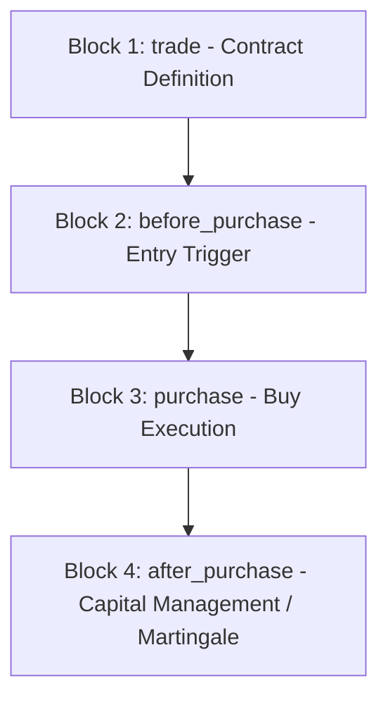

# 🤖 Structural Mapping and Bot Archetypes (Deriv DBot XML) - ORSTAC

This document serves as the RAG (Retrieval-Augmented Generation) knowledge base for the **ORSTAC AI Cognitive Agent**. It categorizes, analyzes, and maps the **3,360 trading robots** in XML format (Google Blockly) contained in the repository. This enables the cognitive agent to perform semantic searches, parse block code structures, and recommend appropriate trading configurations to users.

---

## 📊 1. Repository Statistical Distribution (Forensic Data)

A forensic audit of all XML files yielded the following empirical distribution statistics across the ORSTAC bot ecosystem:

### 🎯 Market Distribution (Top 10)
| Asset / Market | Bot Count | Proportion (%) | Description |
| :--- | :---: | :---: | :--- |
| **Volatility 100 Index** | 1,985 | 59.1% | The most active and volatile synthetic market, preferred for rapid Digits and Martingale bots. |
| **Volatility 10 Index** | 314 | 9.3% | Lower volatility index, ideal for mid-term trend strategies. |
| **Volatility 50 Index** | 296 | 8.8% | Balanced price movement index. |
| **Volatility 75 Index** | 191 | 5.7% | Classic volatility range, commonly paired with standard technical indicators. |
| **Volatility 25 Index** | 161 | 4.8% | Constant low volatility index. |
| *Unknown / Custom* | 95 | 2.8% | Bots without preset assets or utilizing dynamic runtime variable selectors. |
| **Volatility 10 (1s) Index** | 85 | 2.5% | One-second tick update index (fast execution). |
| **Volatility 100 (1s) Index** | 41 | 1.2% | Maximum volatility with fast one-second tick updates. |
| **EUR/USD (Forex)** | 38 | 1.1% | Traditional currency pair, subject to standard market opening hours. |
| **Bear / Bull Market Indices** | 59 | 1.8% | Synthetic index simulating permanent downward (Bear) or upward (Bull) trends. |

### 🛠️ Contract Type Distribution
| Contract Type (DBot Value) | Bot Count | Proportion (%) | Operational Logic |
| :--- | :---: | :---: | :--- |
| **Rise / Fall (risefall)** | 1,139 | 33.9% | Predicts whether the exit spot is strictly higher (Call) or lower (Put) than the entry. |
| **Over / Under (overunder)** | 710 | 21.1% | Focuses on the last digit of the price (e.g. predicting it will be greater/less than a target). |
| **Matches / Differs (matchesdiffers)** | 457 | 13.6% | Predicts whether the last digit matches a target digit (Matches) or is different (Differs). |
| **Higher / Lower (highlow)** | 372 | 11.1% | The exit spot must be higher or lower than a defined barrier offset. |
| **Even / Odd (evenodd)** | 316 | 9.4% | Predicts whether the last digit of the contract will be an even or odd number. |
| *Others / Unspecified* | 158 | 4.7% | Dynamically selected at runtime or manually loaded. |
| **Touch / No Touch (touchnotouch)** | 65 | 1.9% | Predicts whether the price will touch a defined barrier offset before expiration. |
| **Stays In / Goes Out (staysinout)** | 44 | 1.3% | Predicts whether the price stays within or breaks out of a price channel. |
| **Asians (asians)** | 31 | 0.9% | Compares the exit spot to the average price of all ticks during the contract. |
| **Reset Call / Reset Put (reset)** | 9 | 0.3% | The entry price resets if the spot reaches a specific barrier value. |

### 📈 Technical Indicator Usage
Many robots depend on mathematical confluences inside their analysis blocks (`before_purchase`):
- **RSI (Relative Strength Index):** 459 bots (Momentum-based overbought/oversold detection on ticks).
- **SMA (Simple Moving Average):** 417 bots (Trend direction smoothing).
- **MACD (Moving Average Convergence Divergence):** 227 bots (Momentum changes and crossover triggers).
- **Bollinger Bands:** 179 bots (Standard deviation channel rebounds).
- **EMA (Exponential Moving Average):** 143 bots (Fast-responding weighted moving averages).

### 💰 Money Management Models
- **Martingale / Multiplicative Recovery:** 1,030 bots (30.6%). Multiplies the stake size following a loss to recover all previous losses in a single win.
- **Soros / Compounding:** 110 bots (3.3%). Reinvests previous trade profits to compound account growth.
- **Flat Stake / Custom Lists / Others:** 2,217 bots (66.1%). Uses flat stakes or predefined progressive lists (e.g. Fibonacci progressions or static stake recovery matrices).

---

## 📂 2. XML Structural Mapping (Deriv DBot Blockly)

The RAG engine uses this structural guide to inspect XML block elements and map operational features:



### 🔑 Critical XML Detection Tags

1. **Market and Asset Definition:**
   The root block is typically of type `trade` or `trade_definition`. The asset symbol is stored inside the `SYMBOL_LIST` field:
   ```xml
   <field name="SYMBOL_LIST">R_100</field>
   ```
2. **Contract & Trade Type:**
   Identified by `TRADETYPECAT_LIST` (category) and `TRADETYPE_LIST` (exact trade model):
   ```xml
   <field name="TRADETYPECAT_LIST">digits</field>
   <field name="TRADETYPE_LIST">matchesdiffers</field>
   ```
3. **Technical Analysis (`before_purchase`):**
   Indicator configurations are mapped using specific block tags:
   - **RSI:** `<block type="rsi">` (uses `PERIOD` and takes `ticksList` input).
   - **SMA:** `<block type="sma">`.
   - **EMA:** `<block type="ema">`.
   - **MACD:** `<block type="macda">`.
   - **Bollinger Bands:** `<block type="bb">` or `<block type="bbg">`.
4. **Post-Purchase & Recovery Multiplier (`after_purchase`):**
   Calculates the next stake. Martingale is identified by a mathematical multiplication block after a loss status check (`contract_check_result` equals `loss`):
   ```xml
   <block type="math_arithmetic" id="...">
     <field name="OP">MULTIPLY</field>
     <value name="A">
       <block type="variables_get">
         <field name="VAR" id="...">stake</field>
       </block>
     </value>
     <value name="B">
       <block type="math_number">
         <field name="NUM">2</field> <!-- Fator multiplicador / Multiplier -->
       </block>
     </value>
   </block>
   ```

---

## 🛠️ 3. Bot Archetypes (Semantic Classification)

The RAG engine classifies bots into four primary functional archetypes:

### 🟢 Class A: Digit Probabilistic Bots
- **Focus:** Fast-paced trading based on the last decimal digit patterns.
- **Contract Types:** `matchesdiffers`, `evenodd`, `overunder`.
- **Common Strategies:**
  - *Safe Differs:* Betting that the last digit is not X (e.g. differs from 8). Yields a ~90% win rate but requires aggressive Martingale scaling on loss (typically `11x` multiplier).
  - *Odd/Even Pattern:* Wait for 3 or 4 consecutive even numbers, then enter Odd (or vice-versa), betting on statistical reversion.
  - *Over/Under Threshold:* Predict that numbers will stay within specific bounds (e.g. Over 2 or Under 8).

### 🔵 Class B: Trend-Following Bots
- **Focus:** Directional market flows.
- **Contract Types:** `risefall` (Rise/Fall) or `highlow` (Higher/Lower) with longer expirations (1–5 minutes or 5-10 ticks).
- **Key Indicators:** Smooth moving average crossovers (9 EMA and 21 SMA) or MACD signal crossings.
- **XML signature:** Use of `logic_compare` evaluating whether the last candle or tick is higher/lower than a moving average block.

### 🟡 Class C: Mean-Reversion Bots
- **Focus:** Spotting overextended price channels.
- **Contract Types:** `risefall`, `touchnotouch`.
- **Key Indicators:** RSI boundaries (overbought above 75-80, oversold below 20-25) or Bollinger Band breakouts.
- **Behavior:** Waits for indicators to reach extrema before placing a trade predicting a price pullback.

### 🔴 Class D: Barrier & Protection (Offset & Barrier)
- **Focus:** Securing payouts by using barrier margins.
- **Contract Types:** `highlow` (Higher/Lower), `touchnotouch` (Touch/No Touch).
- **Logic:** Uses an offset value (e.g. `+0.5` or `-1.2`). Requires price movement to clear the barrier threshold. Delivers higher payouts (100% to 500%+) on successful executions.

---

## 🏆 4. The 3 ORSTAC Champions (Elite Blueprints)

These three bots were curated from the repository audits as structural benchmarks for DBot development:

### 1️⃣ The Mathematical Brain: `safe profit pro.xml`
- **Archetype:** Combined Trend & Reversion (Class B + C).
- **Indicators:** Multi-timeframe confluence of EMA, RSI, and MACD.
- **Risk Management:** Predefined progression list (`0.35`, `0.39`, `0.80`, `1.62`, `3.36`, `6.98`, `14.4`, `30.06`). Avoids geometric doubling, capping drawdowns at 8 calculated steps to protect equity.
- **Target Market:** Volatility 100 Index (`R_100`).

### 2️⃣ The Price Action Analyst: `Candlestick v2.xml`
- **Archetype:** Chart patterns (Price Action).
- **Logic:** Reads candle high, low, open, and close levels. Implements boolean checks to detect Hammer, Shooting Star, and Engulfing patterns.
- **Advantage:** Trades based on raw price formation rather than lagging mathematical averages.
- **Target Market:** Highly volatile, structured asset classes.

### 3️⃣ The Bankroll Manager: `Rise-Fall - Consistent - Trends.xml`
- **Archetype:** Conservative Trend Follower (Class B).
- **Risk Management:** Micro-recovery compounding. Instead of a standard `2.0x` multiplier, this bot uses a conservative **`1.071x`** recovery factor.
- **Logic:** Prioritizes steady, low-risk account growth. Survives long drawdowns (red blocks) without risking account liquidation.
- **Target Market:** Extended trading sessions and low-capital accounts.

---

## 🔍 5. Search & Indexing Guidelines for RAG

To retrieve accurate information from this knowledge base, questions should be parsed using matching index keys:

```json
{
  "rag_indexing_keys": {
    "market": ["R_10", "R_25", "R_50", "R_75", "R_100", "synthetics"],
    "contract": ["risefall", "matchesdiffers", "overunder", "evenodd", "highlow"],
    "indicator": ["RSI", "SMA", "EMA", "MACD", "Bollinger"],
    "risk": ["martingale", "soros", "flat_stake", "stake_list"]
  }
}
```

### Retrieval Mapping Examples:
1. *User Prompt:* "Which bot is best for small accounts to avoid quick losses?"
   - *Mapping:* Target `[risk: stake_list]` or `[risk: martingale suave]`, retrieving `Rise-Fall - Consistent - Trends.xml`.
2. *User Prompt:* "How do I build an Odd/Even binary digit bot?"
   - *Mapping:* Target `[contract: evenodd]`, showing `<field name="TRADETYPE_LIST">evenodd</field>`.
3. *User Prompt:* "What technical indicators does Safe Profit Pro use?"
   - *Mapping:* Target `safe profit pro.xml`, retrieving its EMA, RSI, and MACD configurations.
